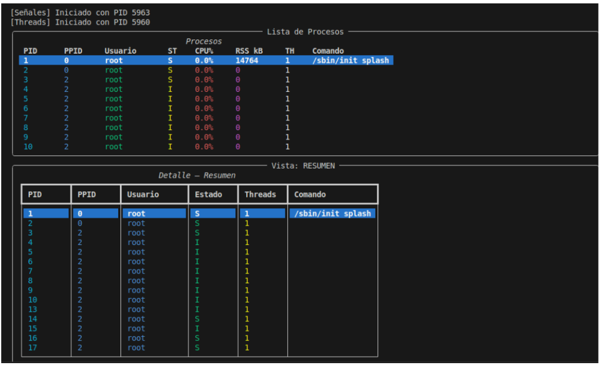
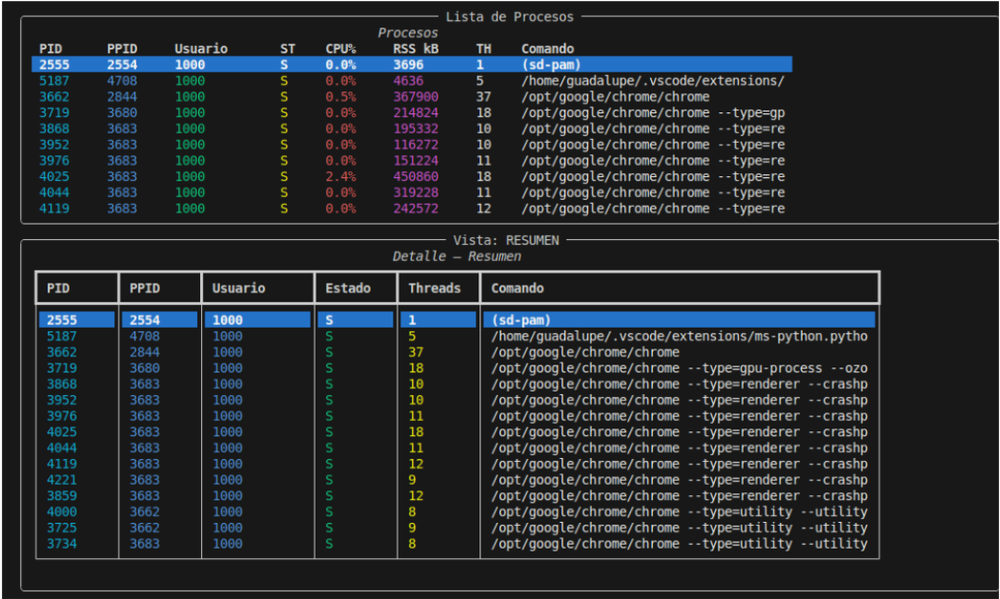
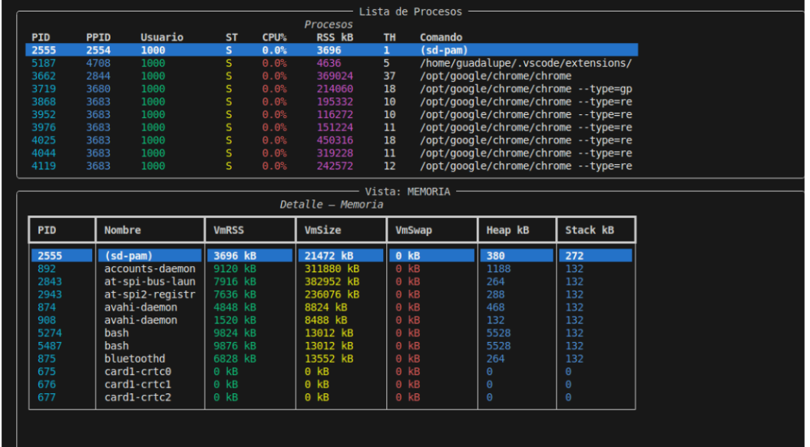
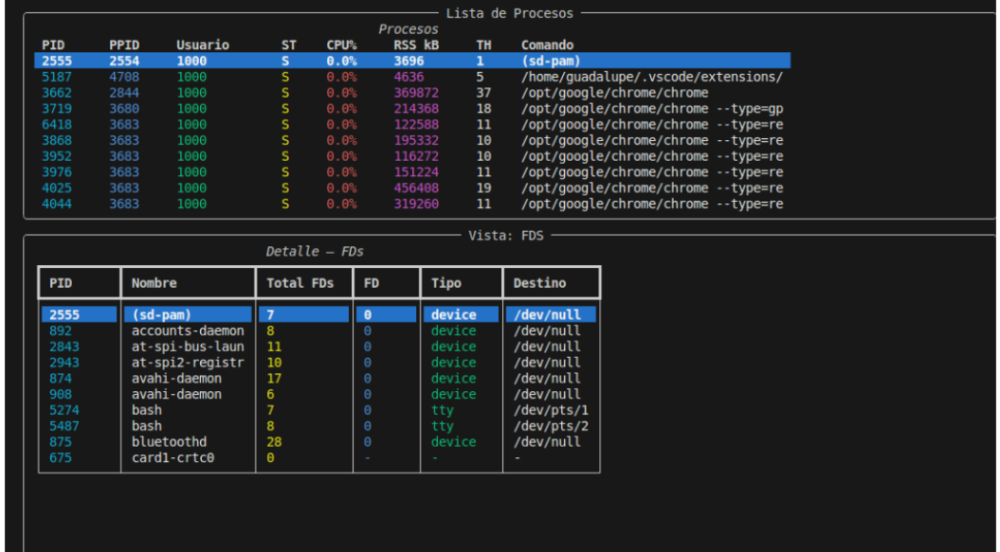
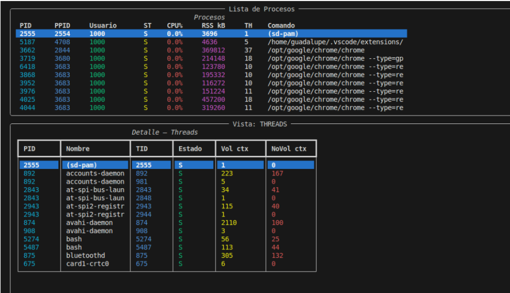
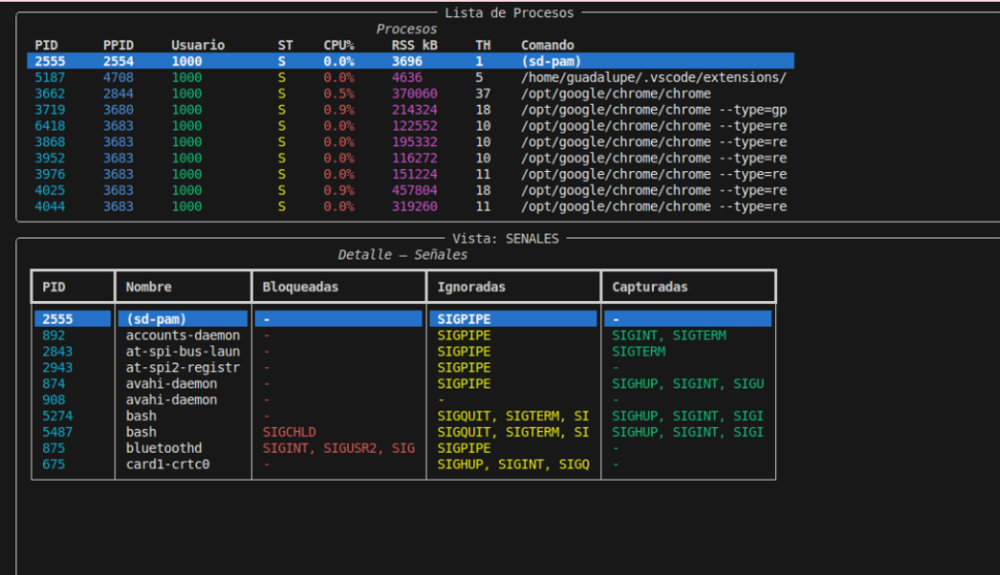
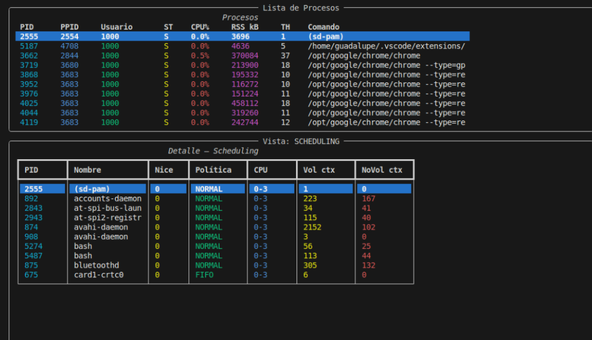
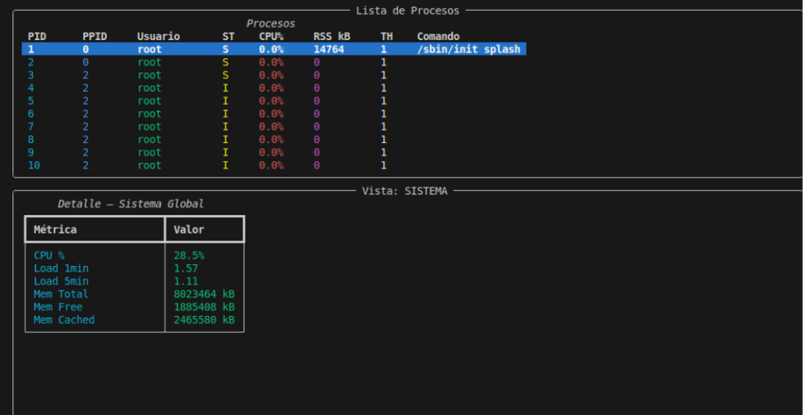
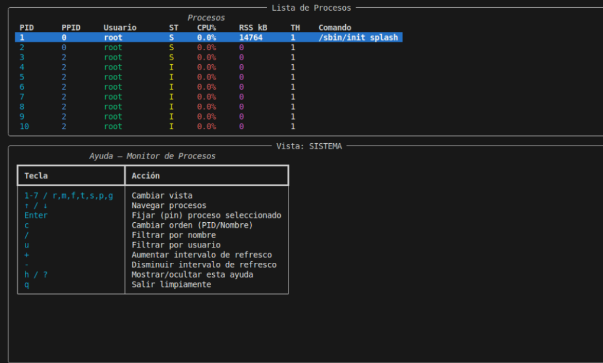

# Monitor de Procesos y Threads — TP1 Computación II

**Alumna:** Yañez, Guadalupe — Universidad de Mendoza — Ingeniería Informática — 2026

---

## 1. Descripción general

Este proyecto implementa un monitor de procesos y threads del sistema operativo Linux en tiempo real, similar a `htop`, pero con énfasis en mostrar la anatomía interna de cada proceso. Toda la información se extrae leyendo directamente el filesystem `/proc` del kernel de Linux, sin usar librerías externas como `psutil`.

El monitor muestra 7 vistas distintas: resumen de procesos, memoria, file descriptors, threads, señales, scheduling y estadísticas globales del sistema.

### Cómo usar

```bash
# Forma recomendada:
docker compose run --rm monitor

# Según enunciado:
docker compose up --build
# Luego en otra terminal:
docker attach tp1-monitor-1
```

### Keybindings

| Tecla | Acción |
|-------|--------|
| `1`-`7` / `r,m,f,t,s,p,g` | Cambiar vista |
| `↑` / `↓` | Navegar por la lista de procesos |
| `Enter` | Fijar (pin) proceso seleccionado |
| `c` | Cambiar orden (PID / Nombre) |
| `/` | Filtrar por nombre de comando |
| `u` | Filtrar por usuario |
| `+` / `-` | Ajustar intervalo de refresco |
| `h` / `?` | Mostrar/ocultar ayuda |
| `q` | Salir limpiamente |

> **Nota sobre filtros:** Presionar `/` o `u`, escribir el texto y presionar `Enter`. Para limpiar, presionar `/` o `u` nuevamente y luego `Esc`.

### Señales

```bash
docker ps                                    # obtener nombre del contenedor
docker kill --signal=SIGUSR1 <nombre>        # dump del snapshot a JSON
docker kill --signal=SIGUSR2 <nombre>        # toggle modo verbose
docker kill --signal=SIGHUP  <nombre>        # recargar config.json
docker kill --signal=SIGTERM <nombre>        # shutdown limpio
```

---

## 2. Diagrama de arquitectura

```
                    ┌─────────────────────────────────────┐
                    │         SNAPSHOT GLOBAL             │
                    │      (Manager.dict compartido)      │
                    │  "resumen"    : { pid: {...}, ... } │
                    │  "memoria"    : { pid: {...}, ... } │
                    │  "fds"        : { pid: {...}, ... } │
                    │  "threads"    : { pid: {...}, ... } │
                    │  "senales"    : { pid: {...}, ... } │
                    │  "scheduling" : { pid: {...}, ... } │
                    │  "sistema"    : { cpu_pct: ..., ... }│
                    └────────▲──────────────────▲─────────┘
                             │ escriben          │ lee
              ┌──────────────┼──────────┐        │
              │              │          │        │
    ┌─────────▼──┐  ┌────────▼──┐      │   ┌───▼──────┐
    │  Resumen   │  │  Memoria  │  ... │   │  Display │
    │  cada 2s   │  │  cada 3s  │      │   │   TUI    │
    └─────────▲──┘  └────────▲──┘      │   └──────────┘
              │  queue_datos  │
              └──────┬────────┘
                     │
              ┌──────▼──────┐
              │  Agregador  │
              └──────▲──────┘
                     │ queue_datos
    ┌────────────────┴──────────────────┐
    │     7 analizadores independientes  │
    └───────────────────────────────────┘
                     ▲
              ┌──────┴──────┐
              │  Recolector │  (una queue_pids por analizador)
              └─────────────┘
                     ▲
                  /proc
```

**Flujo de datos:**

```
/proc → Recolector → queue_pids_X → Analizador X → queue_datos → Agregador → Manager.dict → Display
```

---

## 3. Decisiones de diseño

### ¿Por qué `Manager.dict` y no un `dict` normal?

Cuando Python crea un proceso con `fork()`, el hijo recibe una **copia** de la memoria del padre. Si usáramos un `dict` normal, cada proceso tendría su propia copia aislada y los cambios de un analizador no serían visibles para los demás.

`Manager.dict` resuelve esto levantando un proceso servidor separado que es el dueño del diccionario. Los demás procesos acceden a través de un proxy y todos ven los mismos datos.

Se eligió `Manager.dict` sobre `Value/Array` porque el diccionario tiene estructura dinámica: distintos procesos tienen distinta cantidad de threads, FDs, señales, etc. Con tipos de tamaño fijo habría que definir el espacio de antemano.

### ¿Por qué una Queue por analizador y no una sola?

Una `Queue` es FIFO: el primer proceso que hace `get()` saca el dato y los demás no lo ven. Si los 6 analizadores compartieran una sola `queue_pids`, solo el más rápido recibiría cada snapshot.

La solución: el recolector tiene una lista de queues y pone el mismo snapshot en todas:

```python
for q in queues_pids:
    q.put(pids_info)
```

### ¿Cómo se manejaron las race conditions?

Al escribir en el `Manager.dict` compartido, usamos un `Lock`:

```python
with lock:
    snapshot[clave] = datos
```

Sin lock, dos analizadores podrían escribir simultáneamente y uno pisaría al otro.

### ¿Por qué `multiprocessing` y no `threading`?

Python tiene el **GIL**: solo un thread ejecuta bytecode a la vez. Para parsear `/proc` de cientos de procesos en paralelo, los threads no dan paralelismo real. Los procesos sí, porque cada uno tiene su propio GIL.

La excepción es el teclado en el display: usamos un thread porque necesitamos compartir `vista_activa` directamente sin IPC.

### Intervalos por defecto

| Analizador | Intervalo | Razón |
|------------|-----------|-------|
| Resumen | 2s | Datos básicos, bajo costo |
| Memoria | 3s | Lectura de `/proc/<pid>/maps` es costosa |
| FDs | 5s | Los FDs cambian poco |
| Threads | 2s | Los threads pueden cambiar rápido |
| Señales | 10s | Las máscaras son muy estables |
| Scheduling | 10s | La política rara vez cambia |
| Sistema | 2s | CPU y memoria cambian constantemente |

---

## 4. Conceptos del curso aplicados

### Clase 3 — Anatomía de procesos y `/proc`

`procfs.py` implementa helpers que leen `/proc` directamente:
- `get_pids()`: lista `/proc` y filtra entradas numéricas
- `read_stat()`: parsea `/proc/<pid>/stat` usando `rfind(')')` para manejar nombres con espacios
- `read_status()`: parsea el formato `clave: valor` de `/proc/<pid>/status`
- `read_cmdline()`: reemplaza separadores `\x00` por espacios

### Clase 4 — fork, exec, wait y zombies

Mostramos el campo `State` de `/proc/<pid>/stat`. Un proceso en estado `Z` es un zombie: terminó pero el padre no llamó a `wait()`. En el shutdown llamamos `p.join()` para evitar generar zombies nosotros mismos.

### Clase 5 — File Descriptors y Pipes

La vista FDs lista los symlinks en `/proc/<pid>/fd/` con `os.readlink()`. Los FDs 0, 1, 2 son stdin, stdout y stderr. `multiprocessing.Queue` internamente usa pipes del sistema operativo.

### Clase 6 — Señales

El monitor maneja 5 señales en `seniales.py`: SIGINT/SIGTERM (shutdown), SIGUSR1 (dump JSON), SIGUSR2 (verbose), SIGHUP (reload config).

La vista Señales decodifica las máscaras hex de 64 bits de `/proc/<pid>/status`:

```python
mascara = int(hex_str, 16)
for n in range(1, 65):
    if mascara & (1 << (n - 1)):
        # señal n está activa
```

### Clase 7 — Memoria compartida

`Manager.dict` usa un proceso servidor interno. Se eligió sobre `mmap` porque permite estructuras dinámicas sin tamaño fijo.

### Clase 8-9 — Multiprocessing

El sistema usa `mp.Process`, `mp.Queue` y `mp.Manager`. Cada componente es un proceso independiente comunicado exclusivamente por primitivas de `multiprocessing`.

### Clase 10 — Threading y GIL

El thread de teclado en el display usa `os.open('/dev/tty', os.O_RDONLY)` en lugar de `sys.stdin` porque `multiprocessing` cierra `stdin` en los procesos hijos reemplazándolo por `/dev/null`.

---

## 5. Capturas de pantalla
5. Capturas de pantalla



















---

## 6. Limitaciones conocidas

1. **`docker compose up --build`**: las teclas no responden porque Docker Compose no conecta stdin directamente. Usar `docker compose run --rm monitor`.
2. **Permisos de `/proc`**: procesos del kernel deniegan acceso a sus FDs. Se maneja con `try/except PermissionError` mostrando `-`.
3. **PIDs efímeros**: un proceso puede morir entre que se lista y se lee. Se maneja con `try/except FileNotFoundError`.
4. **Dump dentro del contenedor**: SIGUSR1 crea el archivo en `/app/` del contenedor. Para accederlo: `docker exec <contenedor> ls /app/dump_*.json`.
5. **Un FD por proceso**: el snapshot tiene todos los FDs pero por espacio se muestra solo el primero.


---

## 7. Cómo correr y testear

### Correr

```bash
git clone <url-del-repo>
cd tp1
docker compose run --rm monitor
```

### Filtros

1. Presionar `/` → escribir nombre → `Enter` para aplicar
2. Presionar `/` → `Esc` para limpiar
3. Igual para `u` (filtro por usuario)

### Señales

```bash
docker ps
docker kill --signal=SIGUSR1 <nombre>
docker exec <nombre> ls /app/dump_*.json
docker exec <nombre> sh -c 'python3 -m json.tool /app/dump_*.json > /dev/null && echo "JSON válido"'
docker kill --signal=SIGUSR2 <nombre>
docker kill --signal=SIGHUP  <nombre>
docker kill --signal=SIGTERM <nombre>
```

---

## 8. Decisiones sobre la TUI

Se eligió `rich` sobre `curses` porque provee tablas, colores y el componente `Live` para actualizaciones en tiempo real sin manejar posiciones de cursor manualmente.

El layout muestra siempre una **lista de procesos arriba** (PID, PPID, Usuario, Estado, CPU%, RSS, Threads, Comando) y un **panel de detalle abajo** que cambia según la vista activa.

---


## 9. Lo que aprendí

Con este trabajo práctico entendí mucho mejor cómo funciona un sistema operativo por dentro. Antes había estudiado la teoría sobre procesos, threads, señales o memoria, pero verla aplicada mientras hacía el monitor hizo que todos esos conceptos se relacionaran y tuvieran mucho más sentido. Por ej una de las cosas que más me sorprendió fue ver a través de /proc toda la información que maneja el kernel. Que desde ahí se pudiera obtener tanto detalle sobre cada proceso, como su memoria, los file descriptors, las señales o la política de planificación, que eran todos temas que habíamos visto sueltos en sistemas operativos y ahora se conectaron.

Aprendí la diferencia entre trabajar con procesos y con hilos. Por ej al principio pensaba que un diccionario de python podía compartirse entre procesos sin problemas, pero al implementar el proyecto entendí por qué eso no funciona y por qué fue necesario usar un Manager.dict junto con Lock para compartir información de forma segura y evitar condiciones de carrera. Otro aprendizaje super importante para mi fue trabajar con Docker. Porque siempre estudié la teoría pero nunca lo había implementado. Tuve que entender cómo se comportan las señales dentro de un contenedor y algunos problemas relacionados con la entrada estándar y la terminal interactiva. Fueron detalles que al principio costaron, pero que me ayudaron a comprender mejor cómo funciona el aislamiento de los contenedores por fin. 

Este trabajo práctico me permitió relacionar muchos temas que habíamos visto por separado durante la cursada. Más allá de hacer un monitor de procesos, terminé entendiendo mejor cómo funciona el sistema operativo, y pude ver esos conceptos funcionando en un proyecto real. También agrego que me gusto mucho la ayuda de acompañar el desarrollo del tp con inteligencia artificial, e ir entendiendo mientras lo completamos, muchas gracias por sumar ese prompt!

---

*TP1 — Computación II — Alumna: Yañez, Guadalupe — Universidad de Mendoza — 2026*
EOF

