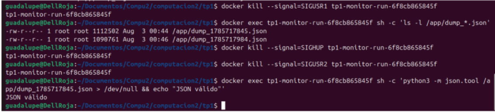

# Monitor de Procesos y Threads — TP1 Computación II
# Alumna: Yañez, Guadalupe — Universidad de Mendoza — Ingeniería Informática — 2026

1. Descripción general
Este proyecto implementa un monitor de procesos y threads del sistema operativo Linux en tiempo real, similar a htop, pero con énfasis en mostrar la anatomía interna de cada proceso. Toda la información se extrae leyendo directamente el filesystem /proc del kernel de Linux, sin usar librerías externas como psutil.

El monitor muestra 7 vistas distintas: resumen de procesos, memoria, file descriptors, threads, señales, scheduling y estadísticas globales del sistema. El usuario puede navegar entre vistas con el teclado mientras el sistema actualiza los datos en segundo plano.

Cómo usar
# Forma recomendada (teclado funciona directamente):
docker compose run --rm monitor

# Según enunciado:
docker compose up --build

# Luego en otra terminal:
docker attach tp1-monitor-1

Keybindings
Tecla: Acción
1-7 / r,m,f,t,s,p,g	:Cambiar vista

↑ / ↓	:Navegar por la lista de procesos

Enter	:Fijar (pin) proceso seleccionado

c	:Cambiar orden (PID / Nombre)

/	:Filtrar por nombre de comando

u	:Filtrar por usuario

+ / -	:Ajustar intervalo de refresco
+ 
h / ?	:Mostrar/ocultar ayuda

q	:Salir limpiamente

Nota sobre filtros: Para activar el filtro presionar / o u, escribir el texto y presionar Enter para aplicar. Para limpiar el filtro, presionar / o u nuevamente y luego Esc.

Señales que responde el monitor
> Obtener el nombre del contenedor
docker ps

> Dump del snapshot a JSON
docker kill --signal=SIGUSR1 <nombre_contenedor>

> Toggle modo verbose
docker kill --signal=SIGUSR2 <nombre_contenedor>

> Recargar config.json
docker kill --signal=SIGHUP <nombre_contenedor>

> Shutdown limpio
docker kill --signal=SIGTERM <nombre_contenedor>

2. Diagrama de arquitectura
                    ┌─────────────────────────────────────┐
                    │         SNAPSHOT GLOBAL             │
                    │      (Manager.dict compartido)      │
                    │  "resumen"    : { pid: {...}, ... } │
                    │  "memoria"    : { pid: {...}, ... } │
                    │  "fds"        : { pid: {...}, ... } │
                    │  "threads"    : { pid: {...}, ... } │
                    │  "senales"    : { pid: {...}, ... } │
                    │  "scheduling" : { pid: {...}, ... } │
                    │  "sistema"    : { cpu_pct: ..., ... }│
                    └────────▲──────────────────▲─────────┘
                             │ escriben          │ lee
              ┌──────────────┼──────────┐        │
              │              │          │        │
    ┌─────────▼──┐  ┌────────▼──┐      │   ┌───▼──────┐

    │  Resumen   │                      │  Memoria  │  ... │         │  Display │
    │  cada 2s      │                       │  cada 3s  │      │          │   TUI    │
    └─────────▲──┘  └────────▲──┘       │  └──────────┘
              │  queue_datos                                             │
              └──────┬────────┘
                                │
              ┌──────▼──────┐
              │  Agregador  │

              └──────▲──────┘
                     │ queue_datos

    ┌────────────────┴──────────────────┐
    │     7 analizadores independientes  │
    └───────────────────────────────────┘
                     ▲

              ┌──────┴──────┐
              │  Recolector │  (una queue_pids por analizador)
              └─────────────┘

                     ▲
                  /proc

Flujo de datos:
/proc → Recolector → queue_pids_X → Analizador X → queue_datos → Agregador → Manager.dict → Display

3. Decisiones de diseño
¿Por qué Manager.dict y no un dict normal?
Cuando Python crea un proceso con fork(), el proceso hijo recibe una copia de la memoria del padre, no la misma memoria. Si usáramos un dict normal, cada proceso tendría su propia copia aislada y las modificaciones de un analizador no serían visibles para los demás.

Manager.dict resuelve esto levantando un proceso servidor separado que es el dueño del diccionario. Los demás procesos acceden a él a través de un proxy, y todos ven los mismos datos.

Se eligió Manager.dict sobre mmap o Value/Array porque el diccionario tiene estructura dinámica: distintos procesos tienen distinta cantidad de threads, FDs, señales, etc. Con mmap habría que definir el tamaño de antemano, lo que causaría fragmentación interna o pérdida de datos.

¿Por qué una Queue por analizador y no una sola?
Una Queue es FIFO: el primer proceso que hace get() saca el dato y los demás no lo ven. Si los 6 analizadores compartieran una sola queue_pids, solo el más rápido recibiría cada snapshot de PIDs.

La solución fue que el recolector tenga una lista de queues y ponga el mismo snapshot en todas:

for q in queues_pids:
    q.put(pids_info)

¿Cómo se manejaron las race conditions?
Al escribir en el Manager.dict compartido, usamos un Lock para garantizar que solo un proceso escribe a la vez:

with lock:
    snapshot[clave] = datos

Sin lock, dos analizadores podrían escribir simultáneamente y uno pisaría al otro.

¿Por qué multiprocessing y no threading para los analizadores?
Python tiene el GIL (Global Interpreter Lock): solo un thread puede ejecutar bytecode Python a la vez. Para tareas CPU-bound como parsear /proc para cientos de procesos en paralelo, los threads no dan paralelismo real.

Los procesos sí tienen paralelismo real porque cada uno tiene su propio intérprete Python con su propio GIL. Por eso los 7 analizadores corren como procesos independientes.

La excepción es la entrada de teclado dentro del display: ahí se usa un thread porque necesitamos compartir la variable vista_activa directamente con el loop de render, sin IPC.

¿Por qué rich y no curses?
rich ofrece una API de alto nivel con tablas, colores y el componente Live para actualizaciones en tiempo real. curses requiere manejar posiciones de cursor y redibujado manual, lo que agrega complejidad innecesaria para este proyecto.

4. Conceptos del curso aplicados
Clase 3 — Anatomía de procesos y /proc
Todo el sistema se basa en leer /proc. El archivo procfs.py implementa los helpers:

get_pids(): lista /proc y filtra entradas numéricas para obtener PIDs activos
read_stat(): parsea la línea cruda de /proc/<pid>/stat, extrayendo el nombre entre ( y ) antes de hacer split para manejar nombres con espacios
read_status(): parsea el formato clave: valor de /proc/<pid>/status
read_cmdline(): lee /proc/<pid>/cmdline y reemplaza los separadores \x00 por espacios

Clase 4 — fork, exec, wait y zombies
Al leer el estado de cada proceso en la vista Resumen, mostramos el campo State de /proc/<pid>/stat. Un proceso en estado Z es un zombie: terminó su ejecución pero su padre todavía no llamó a wait() para recoger su exit code.

Cuando el monitor crea sus procesos hijos con mp.Process, llamamos p.join() en el shutdown para evitar generar zombies nosotros mismos.

Clase 5 — File Descriptors y Pipes
La vista de FDs lista los symlinks en /proc/<pid>/fd/ con os.readlink(). Los tres primeros FDs (0, 1, 2) son stdin, stdout y stderr. El tipo se infiere del destino: si apunta a /dev/pts/X es una terminal, si empieza con socket: es un socket, si empieza con pipe: es un pipe anónimo.

La comunicación entre procesos del monitor usa multiprocessing.Queue, que internamente implementa un pipe anónimo.

Clase 6 — Señales
El monitor maneja 5 señales registradas en seniales.py:

SIGINT (2) y SIGTERM (15): shutdown limpio, termina todos los hijos
SIGUSR1 (10): dump del snapshot a dump_<timestamp>.json
SIGUSR2 (12): toggle modo verbose
SIGHUP (1): recarga config.json

La vista de señales muestra las máscaras SigBlk, SigIgn, SigCgt y SigPnd de cada proceso. Son números hexadecimales de 64 bits donde cada bit representa una señal, decodificadas con operaciones bitwise:

mascara = int(hex_str, 16)

for num_senal in range(1, 65):

    if mascara & (1 << (num_senal - 1)):

        # la señal num_senal está activa

Clase 7 — Memoria compartida
El Manager.dict usa un proceso servidor interno que gestiona el diccionario compartido. Se eligió sobre mmap directo porque permite estructuras de datos dinámicas sin tamaño fijo predefinido.

Clase 8-9 — Multiprocessing
El sistema usa mp.Process, mp.Queue y mp.Manager. Cada componente es un proceso independiente. La comunicación usa exclusivamente primitivas de multiprocessing.

Clase 10 — Threading y GIL
Se usa un thread interno en el proceso display para leer el teclado con tty.setcbreak y os.open('/dev/tty', os.O_RDONLY). Se usa /dev/tty en lugar de sys.stdin porque multiprocessing cierra stdin en los procesos hijos reemplazándolo por /dev/null.

5. Capturas de pantalla

6. Limitaciones conocidas
docker compose up --build: con este comando las teclas no responden porque Docker Compose no conecta stdin directamente al contenedor. Se recomienda usar docker compose run --rm monitor.

Permisos de /proc: procesos del kernel pueden denegar acceso a sus FDs o maps. El código maneja esto con try/except PermissionError y muestra - en esos casos.

Race condition en PIDs efímeros: entre el momento en que el recolector lista los PIDs y el momento en que el analizador los lee, un proceso puede haber terminado. Se maneja con try/except FileNotFoundError.

El dump JSON queda dentro del contenedor: cuando se envía SIGUSR1, el archivo dump_<timestamp>.json se crea en /app/ dentro del contenedor, no en el host. Para accederlo: docker exec <contenedor> cat /app/dump_*.json.

Un solo FD por proceso en la vista FDs: por espacio en pantalla, se muestra solo el primer FD de cada proceso. El snapshot almacena todos los FDs pero por espacio se muestra solo el primero

7. Cómo correr 

Requisitos
Docker y Docker Compose instalados

Correr el monitor

git clone <url-del-repo>

cd tp1

docker compose run --rm monitor

Navegar las vistas
Teclas 1 a 7 o r,m,f,t,s,p,g para cambiar de vista
h para ver todos los keybindings disponibles

Usar filtros
Presionar / para filtrar por nombre (ej: escribir python y Enter)
Presionar / nuevamente y luego Esc para limpiar el filtro
Lo mismo aplica para u (filtro por usuario)

Probar las señales
En otra terminal mientras el monitor corre:

docker ps  # anotar el nombre del contenedor

docker kill --signal=SIGUSR1 <nombre>  # genera dump JSON

docker exec <nombre> ls /app/dump_*.json  # verificar el dump

docker exec <nombre> sh -c 'python3 -m json.tool /app/dump_*.json > /dev/null && echo "JSON válido"'

docker kill --signal=SIGUSR2 <nombre>  # toggle verbose

docker kill --signal=SIGHUP <nombre>   # reload config

docker kill --signal=SIGTERM <nombre>  # shutdown limpio

8. Decisiones sobre la TUI
Se eligió rich sobre curses porque:

rich provee tablas con colores, bordes y alineación automática sin código manual
El componente Live maneja el redibujado eficiente de la pantalla
La curva de aprendizaje es mucho menor que curses
Para el alcance de este TP, las limitaciones de rich no representaron un problema real

El layout consiste en una tabla que ocupa toda la pantalla, con el título mostrando la vista activa, el orden actual y el intervalo de refresco. Cuando hay filtros activos, se muestran en el título también.

9. Lo que aprendí (escrito personalmente)

Con este trabajo práctico entendí mucho mejor cómo funciona un sistema operativo por dentro. Antes había estudiado la teoría sobre procesos, threads, señales o memoria, pero verla aplicada mientras hacía el monitor hizo que todos esos conceptos se relacionaran y tuvieran mucho más sentido. Por ej una de las cosas que más me sorprendió fue ver a través de /proc toda la información que maneja el kernel. Que desde ahí se pudiera obtener tanto detalle sobre cada proceso, como su memoria, los file descriptors, las señales o la política de planificación, que eran todos temas que habíamos visto sueltos en sistemas operativos y ahora se conectaron.

Aprendí la diferencia entre trabajar con procesos y con hilos. Por ej al principio pensaba que un diccionario de python podía compartirse entre procesos sin problemas, pero al implementar el proyecto entendí por qué eso no funciona y por qué fue necesario usar un Manager.dict junto con Lock para compartir información de forma segura y evitar condiciones de carrera. Otro aprendizaje super importante para mi fue trabajar con Docker. Porque siempre estudié la teoría pero nunca lo había implementado. Tuve que entender cómo se comportan las señales dentro de un contenedor y algunos problemas relacionados con la entrada estándar y la terminal interactiva. Fueron detalles que al principio costaron, pero que me ayudaron a comprender mejor cómo funciona el aislamiento de los contenedores por fin. 

Este trabajo práctico me permitió relacionar muchos temas que habíamos visto por separado durante la cursada. Más allá de hacer un monitor de procesos, terminé entendiendo mejor cómo funciona el sistema operativo, y pude ver esos conceptos funcionando en un proyecto real. También agrego que me gusto mucho la ayuda de acompañar el desarrollo del tp con inteligencia artificial, e ir entendiendo mientras lo completamos, muchas gracias por sumar ese prompt!

TP1 — Computación II — Alumna Yañez Guadalupe — 2026 — UM

